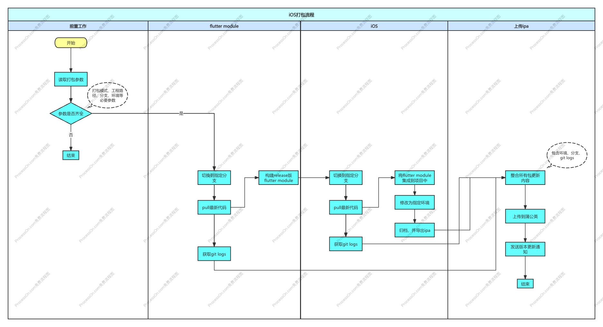
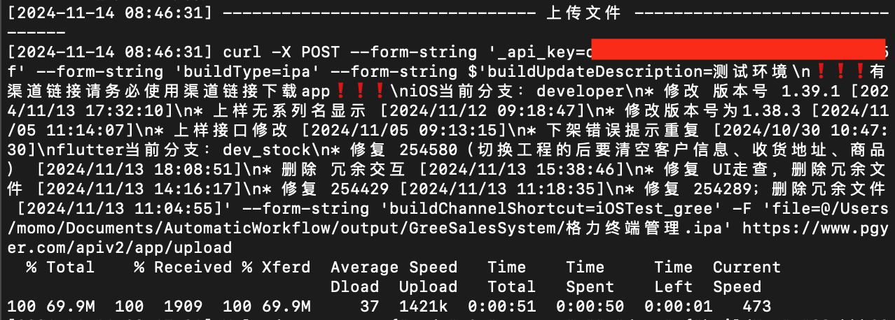
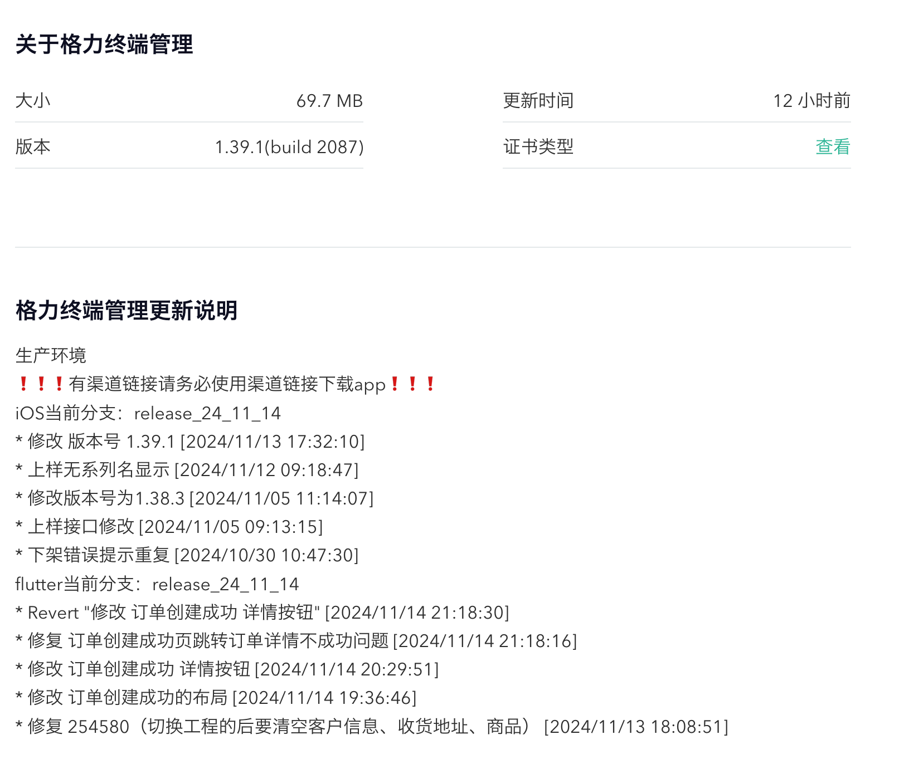
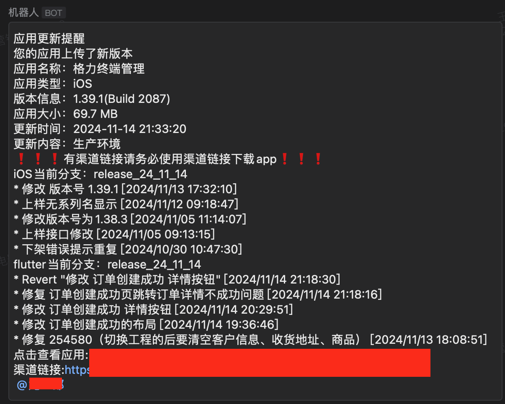

# iOS一键打包脚本
## 背景
1. 手动打包耗费时间长，影响开发、测试进度；
2. flutter混iOS原生打包都是一些有规律的重复性操作；
3. 手动打包，无法准确跟踪测试包版本对应的git分支和commit节点，影响开发分析问题；
4. 不同环境的测试包全在同一个链接中，不利于测试人员开展测试工作。
5. 新测试包上传成功要手动通知相关人员；
## 解决方案
macOS基于Unix的操作系统，对Shell非常友好，支持多种Shell，具有良好的环境来编写和运行Shell脚本。可以使用Shell结合git 、flutter、xcodebuild、curl等命令将重复性操作，全部转成自动化，解放双手，实现一边开发、一边打包。另外整合使用的git分支和最近的commit描述和时间等重要信息，标记测试版本。使用蒲公英平台的渠道功能，区分不同的环境/某个功能点的测试包。利用蒲公英提供的Webhook将版本更新通知同步到企业微信群。
## 自动打包流程

## 成果

## 优化点
1. 前期的版本，需要在命令中传入大量的打包参数（如：蒲公英api key、蒲公英渠道短链接、flutter module的路径、iOS工程的路径、ipa名称、环境以及修改环境相关的代码），脚本使用体验不太好，也影响使用效率。参考xcodebuild，将一些不常改动的参数使用plist文件存储，然后再使用PlistBuddy读取plist文件。目前在配置好plist文件的情况下，通常只要传如4个参数。
2. 拆分git、修改文件内容、上传相关的功能，然后按需组合，利于维护以及代码重用。
3. 上传ipa到蒲公英时，减少不必要的校验，改用蒲公英更快速的接口，提高速率（从普遍的20-30分钟，提升到10-15分钟，网络较好的情况下可以达到1-3分钟）。
## 总结
1. 首次使用shell完成一个完整的功能，日常工作中使用的大多是面向对象的编程语言，此次从理论到实践更加深刻了解面向过程的编程语言。
2. 很多大功能点，都可以采用搭积木的模式，拆分出一个个基础功能点，再进行组合，不但利于代码维护和复用，同时也能很快厘清逻辑思路。这种模式在我的日常开发工作中也起到很显著的作用，特别是一些业务需求很复杂的情况。
3. 目前该脚本的不足主要是：仅适用于终端管理app这个项目，不能直接用于其他的iOS项目。当然因为目前已经有了多个基础功能，小范围改动一下也可以满足其他iOS项目的使用。

